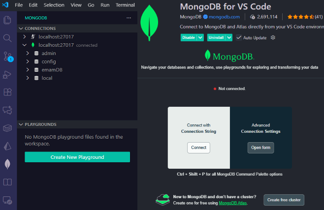

# <p align="center">mongodb-fundamentals</p>

<p align="center">
  
</p>

# QUICK SETUP
1. Go to: https://www.mongodb.com/try/download/community  <br>
2. Choose Windows/macOS/Linux → Download  <br>
3. Install (default path is fine) <br>
4. Compass is included in the installer (tick it) <br>
5. Open MongoDB Compass → It auto-detects local server <br>
<b><i><u>Your local MongoDB is running on mongodb://localhost:27027 (default port) </u></i></b>
 
 
# Check Version & Start Server 
```
mongod --version
// or
mongo --version
```

# Check MongoDB Service (Server running or not) 
cmd = win + R 
```
services.msc 
```
Find MongoDB Server 
If it exists → MongoDB is installed. 

# Vs code 

<p align="center">
  
</p>